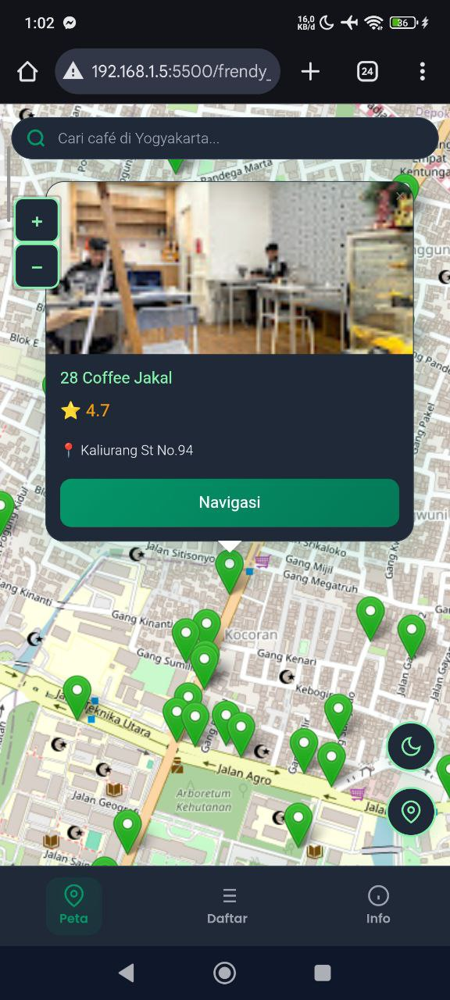
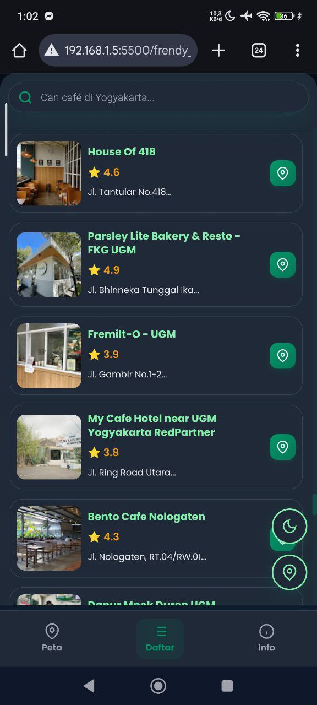

# UGM Nugas Map

## Nama Produk
**UGM Nugas Map** - Aplikasi Peta Interaktif Café Yogyakarta

## Deskripsi Produk
UGM Nugas Map adalah aplikasi web yang menyediakan peta interaktif untuk menemukan dan menjelajahi berbagai café terbaik di Yogyakarta. Aplikasi ini dirancang khusus untuk memudahkan pengguna dalam menemukan lokasi café, mengetahui detail lengkap, rating, dan jarak dari lokasi pengguna saat ini. Dengan antarmuka yang responsif dan user-friendly, aplikasi ini dapat diakses dari berbagai perangkat baik desktop maupun mobile.

## Komponen Pembangun Produk

Aplikasi ini dibangun menggunakan teknologi web modern dengan komponen-komponen berikut:

### Frontend Technology
- **HTML5** - Struktur dan markup halaman
- **CSS3** - Styling dengan dukungan dark mode
- **JavaScript (Vanilla)** - Logika interaktif dan manipulasi DOM
- **Google Fonts (Poppins)** - Typography yang elegan

### Geolocation & Mapping
- **Leaflet.js** - Library peta interaktif open-source
- **OpenStreetMap** - Tile layer untuk peta
- **Geolocation API** - Mendapatkan lokasi pengguna real-time

### Fitur Utama
- 📍 **Peta Interaktif** - Visualisasi lokasi café dengan marker berwarna
- 🔍 **Fitur Pencarian** - Pencarian café berdasarkan nama atau alamat
- 📱 **Responsive Design** - Kompatibel dengan semua ukuran layar
- 🌙 **Dark Mode** - Mode gelap untuk kenyamanan mata
- 📍 **Geolocation** - Fitur untuk menemukan lokasi pengguna
- 📊 **Daftar Café** - Tampilan list dengan rating dan jarak
- 🎯 **Navigation** - Integrasi Google Maps untuk navigasi

## Sumber Data

Data café yang ditampilkan dalam aplikasi ini bersumber dari:
- **Google Maps Yogyakarta** - Informasi lokasi, rating, dan alamat café
- **data.json** - File database lokal yang berisi kumpulan informasi café dengan atribut:
  - ID café
  - Nama café
  - Alamat lengkap
  - Koordinat geografis (latitude, longitude)
  - Rating/bintang
  - URL foto/gambar

## Tangkapan Layar Komponen Penting

### Tampilan Peta Interaktif
Layar utama menampilkan peta interaktif dengan marker lokasi café, fitur pencarian floating, dan kontrol navigasi.

### Tampilan Daftar Café & Mode Gelap
Layar daftar menampilkan semua café dalam bentuk kartu dengan jarak, rating, dan fitur navigasi. Aplikasi juga mendukung dark mode untuk kenyamanan pengguna.

## Cara Menggunakan

1. **Buka Aplikasi** - Akses file `frendy_web.html` di browser
2. **Lihat Peta** - Peta akan menampilkan semua café di Yogyakarta
3. **Cari Café** - Gunakan kotak pencarian untuk menemukan café spesifik
4. **Lihat Detail** - Klik marker atau item di daftar untuk melihat informasi lengkap
5. **Gunakan Lokasi Saya** - Klik tombol lokasi untuk melihat café terdekat
6. **Navigasi** - Klik tombol navigasi untuk membuka di Google Maps

## File-file Penting

- `frendy_web.html` - File HTML utama aplikasi
- `frendy_style.css` - File CSS untuk styling
- `data.json` - Database café dalam format JSON
- `README.md` - Dokumentasi proyek

---

**Proyek Responsi PGPBL - Universitas Gadjah Mada**
